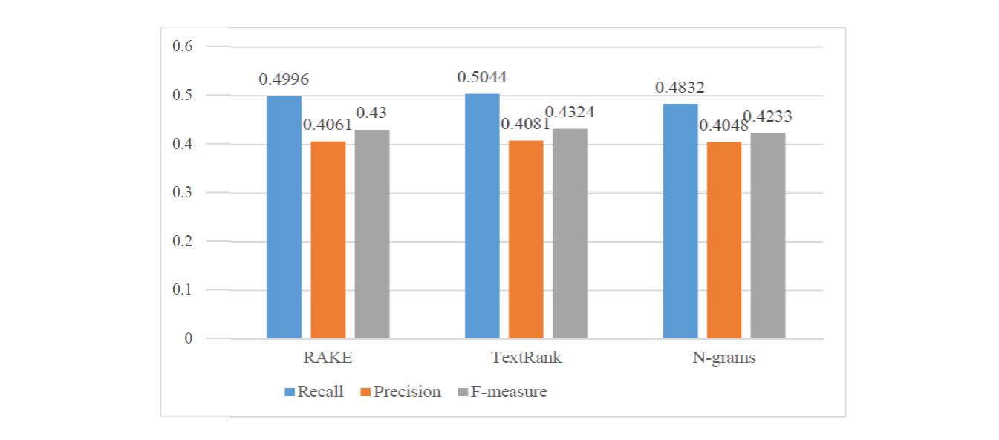
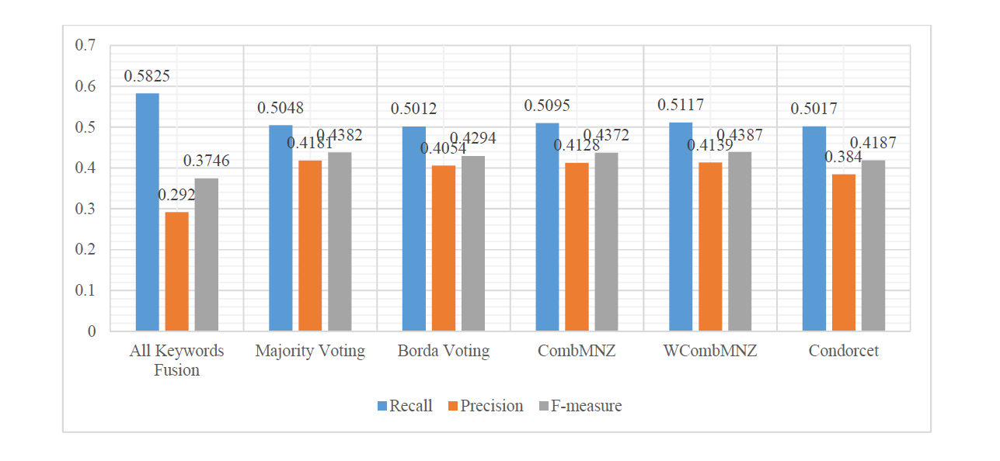

# A Fusion-based Extraction of Key Phrases From Abstracts of Scientific Articles

## Overview

The main objective of this research is to extract keywords from documents using a fusion-based technique, which is based on three other existing techniques that use *"Hulth 2003"* as a dataset for training and testing. 

Keywords can be defined as the words that represent the content of the whole text, which can help users identify what the article is about without having to read it entirely. Filtering documents using “keywords” can be regarded as short summaries, which may save time while searching. Keywords extraction is an important technology in many areas of information technology and document processing such as document tagging, text categorization and summarization, and most importantly, the use in information retrieval. The main aim of any
keywords extraction system is to automatically identify the most informative and important words that best describe the document. The simplest possible approach is perhaps to use a frequency criterion to select the important keywords in a document. However, this method was generally found to lead to poor results. Consequently, methods like RAKE, TextRank, and N-grams were explored.

As mentioned above, this research will introduce a fusion-based technique. The three original techniques produce their results as lists of extracted keywords. This new technique integrates and calculates the results of those three techniques to produce its’ own results of more accurate keywords than the keywords that are produced individually.

After implementing the four techniques above, the results were evaluated using precision, recall, and F-measure. The dataset that was used is *"Hulth 2003"*, which consists of 2000 scientific abstracts; 1000 of which are used as training data and 500 of which are used as testing data.

The maximum recall that has been achieved on this testing set using RAKE is 0.4996, precision is 0.4061, and F-measure is 0.43. Regarding TextRank, its maximum achieved recall is 0.5044, precision is 0.4081, and F-measure is 0.4324. The last original technique, N-grams, obtained its highest recall of 0.4832, precision of 0.4048, and F-measure of 0.4233. 

Finally, in order to achieve the highest results possible, six different fusion-based techniques has been implemented. Each one of the six techniques used a different strategy.\
The first technique was All Keywords Fusion which is based on term frequency, the second was Majority Voting, which is based on document frequency, the third was Borda Voting that is based on Borda count voting procedure by assigning weights for each candidate keyword, the fourth technique is based on combining term weight and document frequency using CombMNZ algorithm, which named CombMNZ, the fifth fusion-based technique was WCombMNZ which is similar to the CombMNZ but with the difference of the weight for each technique from the original RAKE, TextRank, and N-grams that was assigned. Finally, the sixth technique was named Condorcet technique, it used the Condorcet voting algorithm.\
After implementing the six fusion-based techniques, it was concluded that the technique that generated the highest results was the WCombMNZ technique compared to the other five techniques. The technique achieved a recall value of 0.5117, a precision value of 0.4139, and F-measure value of 0.4387.

## Technologies & Tools
* Perl programming language
* Strawberry Perl 5.30.1.1, For more information please [click here](http://strawberryperl.com/).
* Notepad++

## Links
This program is published on [GitHub](https://github.com/AmjedAyoub/A-Fusion-based-Extraction-of-Key-Phrases-From-Abstracts-of-Scientific-Articles).

## Future Work
This research can be further developed and improved in a number of directions as follows:
* Improving the system to be applied to more documents by increasing dataset size.
* Applying different weighting methods to the fusion-based techniques that could be useful for improving results.
* Applying the keywords and key phrases extraction using RAKE, TextRank, and N-grams to documents that have larger lengths than just abstracts.
* Applying the keywords and key phrases extraction using RAKE, TextRank, and N-grams to multi documents of the same topic.